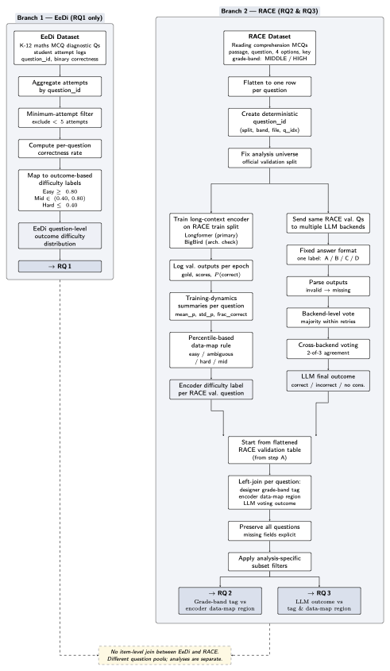

<div align="center">

# 🧭 Human–Machine Difficulty Alignment

### Quantifying Question Difficulty via Students, Designers, Text Encoders & LLMs

*A **Data Cartography**-driven framework for measuring whether humans, instructional designers, discriminative encoders, and generative LLMs agree on what makes a question "hard."*

[](https://www.python.org/)
[](https://pytorch.org/)
[](https://github.com/huggingface/transformers)
[](LICENSE)
[](#)

</div>

---

## 📖 Overview

Large Language Models are increasingly used to *generate* and *grade* educational content, yet their internal notion of "difficulty" is rarely checked against how humans actually experience a question. This project builds an empirical pipeline that puts **four independent perspectives on difficulty side by side**:

| Perspective | Source | Signal |
|---|---|---|
| 🎓 **Student** | Real student response logs (Eedi) | Empirical accuracy / error rate |
| 🧑‍🏫 **Instructional Designer** | RACE benchmark metadata | Curated grade level (Middle / High) |
| 🤖 **Text Encoder (BERT-family)** | Fine-tuned discriminative model | Training-dynamics-based *Data Cartography* |
| 🧠 **LLM** | GPT-4o / Doubao / DeepSeek | Zero-shot answering correctness & majority vote |

The core methodological device is **[Data Cartography](https://arxiv.org/abs/2009.10795)**: instead of only looking at final accuracy, we record how a discriminative model's confidence in the *gold* answer evolves epoch-by-epoch, and use that trajectory to place every item into an **Easy-to-learn 🟢 / Ambiguous 🟡 / Hard-to-learn 🔴** region — a data-driven, model-based stand-in for "difficulty" that can be directly compared against student, designer, and LLM judgments.

<p align="center">
  
</p>

---

## ✨ Highlights

- **Four-way alignment analysis** — student, designer, encoder, and LLM difficulty views merged into one comparable table.
- **Data Cartography from scratch** — a custom training-dynamics recorder for long-context encoders (Longformer / BigBird / RoBERTa) that survives the "Trainer collapses to chance accuracy" failure mode.
- **Multi-backend LLM protocol** — a *frozen*, reproducible answering protocol (temperature=0, fixed retries, 2-of-3 backend voting) across GPT-4o, Doubao, and DeepSeek.
- **IRT-based human–machine bridging** — 1PL/2PL/3PL Item Response Theory models linking real student ability (Eedi), a stratified human "Bridge" panel, and machine/LLM-simulated respondents on a common difficulty scale.
- **End-to-end reproducible scripts** — every figure and table in the pipeline is produced by a script in [`scripts/`](scripts), not a notebook.

---

## 🗺️ Pipeline at a Glance

```
                 ┌───────────────────────┐
                 │   Phase 1 — Eedi      │   Student accuracy → Human difficulty buckets
                 │   (Student view)      │
                 └───────────┬───────────┘
                             │
                 ┌───────────▼───────────┐
                 │   Phase 2 — RACE      │   Fine-tune Longformer/BigBird
                 │   Encoder Training +  │   → per-epoch training dynamics
                 │   Data Cartography    │   → Easy / Ambiguous / Hard regions
                 └───────────┬───────────┘
                             │
                 ┌───────────▼───────────┐
                 │   Phase 3 — LLM       │   GPT-4o / Doubao / DeepSeek
                 │   Inference           │   → majority-vote difficulty signal
                 └───────────┬───────────┘
                             │
                 ┌───────────▼───────────┐
                 │   Phase 4 — Alignment │   Merge all 4 views → Data-Map scatter,
                 │   Analysis            │   agreement stats, designer-vs-views plots
                 └───────────┬───────────┘
                             │
                 ┌───────────▼───────────┐
                 │  Revision Suite E0–E11│   IRT model family, human–machine bridge,
                 │  (scripts/revision)   │   agreement sensitivity, review-efficacy sim
                 └───────────────────────┘
```

---

## 📂 Repository Structure

```
.
├── scripts/                          # Core pipeline (Phases 1–4)
│   ├── Eedi_human_difficulty_analysis.py   # Phase 1 — student accuracy → difficulty buckets
│   ├── RACE_process_data.py                # Phase 2 — flatten RACE JSONL → CSV
│   ├── RACE_prepare_and_designer_stats.py  # Phase 2 — prep splits + designer stats
│   ├── check_input_len.py                  # Phase 2 — token-length / truncation check
│   ├── RACE_train_bert_models_trainer.py   # Phase 2 — encoder fine-tuning + dynamics logging
│   ├── LLM_request.py                      # Phase 3 — multi-backend LLM request helpers
│   ├── proecess_test.py                    # Phase 3 — post-process LLM outputs
│   ├── RACE_analyze_views_with_datamap.py  # Phase 4 — merge 4 views + Data Map metrics
│   ├── hfd.sh                              # Hugging Face model downloader
│   └── revision/                     # Extended experiment suite (E0–E11)
│       ├── common.py                       # Shared utilities
│       ├── e0_build_integrated_table.py    # Merge official RACE val + encoder + LLM votes
│       ├── e1_train_mc.py / e1_train_custom.py   # Claim-preserving encoder retrain paths
│       ├── e1_encoder_cartography.py        # Train-vs-val cartography diagnostics
│       ├── e2_*                             # Multi-backend LLM fills / voting / aggregation
│       ├── e3_*                             # Human–machine "Bridge" item collection apps
│       ├── e4_agreement_sensitivity.py      # Agreement stats & cartography sensitivity
│       ├── e5_eedi_reliability.py           # Eedi label reliability & shrinkage
│       ├── e6_rating_app.py                 # Blind content-quality rating UI
│       ├── e7_review_efficacy.py            # Review-efficacy offline simulation
│       ├── e8_*                             # Open-ended / constructed-response pilot
│       ├── e9_irt_model_family.py           # 1PL / 2PL / 3PL IRT model family
│       ├── e10_expand_machine_students.py   # LLM-simulated student panel expansion
│       ├── e11_paper1_llm_vs_human_items.py # LLM- vs human-authored item difficulty (IRT)
│       └── run_all_local.py                 # Run everything that needs no GPU/API/humans
├── configs/
│   └── llm_protocol.yaml             # Frozen LLM answering protocol (decoding, voting rule)
├── prompts/
│   └── race_mcq_prompt.txt           # RACE multiple-choice prompt template
├── asse/, figures/, Eedi_analysis/, race_analysis_with_datamap/   # Illustrative figures used below
├── build_env.sh                      # One-shot environment bootstrap
├── run.sh                            # Example end-to-end run
├── requirements.txt
└── LICENSE
```

> 📌 **Not included in this release:** raw datasets, trained model checkpoints, generated logs/outputs, and the internal audit/freeze trail used for manuscript verification. These are intentionally excluded to keep the public repository focused on the *code* needed to understand and reproduce the method — see [Data & Models](#-data--models) below for how to obtain them.

---

## 🚀 Getting Started

### 1. Environment

```bash
git clone https://github.com/XianghuiMeng-1020/human_machine_difficulty_alignment.git
cd human_machine_difficulty_alignment

# Option A — quick bootstrap
bash build_env.sh

# Option B — pip
pip install -r requirements.txt
```

### 2. Download base encoders

```bash
bash scripts/hfd.sh allenai/longformer-base-4096
mv longformer-base-4096 models/
bash scripts/hfd.sh google/bigbird-roberta-base
mv bigbird-roberta-base models/
```

### 3. LLM API credentials

The multi-backend LLM protocol reads credentials from environment variables — **no keys are hard-coded**:

| Backend | Environment variables |
|---|---|
| OpenAI-compatible (GPT-4o) | `GPT_API_KEY`, `GPT_BASE_URL`, `GPT_MODEL` |
| Doubao (Volcengine Ark) | `ARK_API_KEY` / `DOUBAO_API_KEY`, `ARK_BASE_URL`, `DOUBAO_MODEL` |
| DeepSeek | `DEEPSEEK_API_KEY`, `DEEPSEEK_BASE_URL`, `DEEPSEEK_MODEL` |

Export these (or place them in a local, git-ignored `.env`) before running any Phase 3 / `scripts/revision/e2_*` script.

---

## 🧪 Usage — The Four Phases

### Phase 1 — Student Perspective (Eedi)

Empirical difficulty from real student attempts, bucketed by accuracy (`Hard ≤ 0.4`, `Mid`, `Easy ≥ 0.8`):

```bash
python scripts/Eedi_human_difficulty_analysis.py \
  --inputs data/train_task_1_2.csv data/train_task_3_4.csv \
  --out_dir Eedi_analysis \
  --easy_thr 0.8 --hard_thr 0.4
```

<p align="center">
  
  
</p>

| Category | Count | Ratio |
|:--|:--:|:--:|
| 🟢 Human-Easy | 6,574 | 23.81% |
| 🟡 Human-Mid | 19,460 | 70.47% |
| 🔴 Human-Hard | 1,579 | 5.72% |

### Phase 2 — Text-Encoder Training & Data Cartography (RACE)

```bash
# Flatten RACE JSONL → per-question CSV, verify token length limits
python scripts/RACE_process_data.py
python scripts/check_input_len.py --data_csv race_prepared/race_mcq_train.csv \
  --model_name models/bigbird-roberta-base --max_len 2048

# Fine-tune with per-epoch training-dynamics logging (8×A100 reference config)
python scripts/RACE_train_bert_models_trainer.py \
  --data_dir race_prepared --out_dir race_trainedmodels \
  --epochs 5 --lr 3e-5 --batch_size 16 --eval_batch_size 32
```

The custom callback records gold-label logits at every epoch end, producing the `training_dynamics_{split}.csv` used for **Confidence / Variability / Correctness** — the three Data-Cartography metrics.

<p align="center">
  
  
</p>
<p align="center">
  
</p>

### Phase 3 — LLM Perspective

Frozen, majority-vote (2-of-3) difficulty signal across GPT-4o / Doubao / DeepSeek — protocol pinned in [`configs/llm_protocol.yaml`](configs/llm_protocol.yaml):

```bash
python scripts/LLM_request.py
python scripts/proecess_test.py
```

### Phase 4 — Multi-View Alignment

Merges designer labels, encoder Data-Map regions, and LLM correctness into one table and produces the head-line comparison figures:

```bash
python scripts/RACE_analyze_views_with_datamap.py \
  --race_val_csv race_prepared/race_mcq_val.csv \
  --bert_pred_csv race_trainedmodels_5e-4_e5_256bs/models_longformer-base-4096/val_predictions.csv \
  --bert_td_csv race_trainedmodels_5e-4_e5_256bs/models_longformer-base-4096/training_dynamics_val.csv \
  --llm_res_jsonl LLM_out/gpt4o_1124/race_llm_prompts_val_gpt.jsonl \
  --out_dir race_analysis_with_datamap
```

<p align="center">
  
  
</p>
<p align="center">
  
  
</p>

**Key finding:** LLM correctness aligns *better* with designer-assigned difficulty than the fine-tuned text encoder does — consistent with the idea that LLM pre-training implicitly captures more of the reasoning structure RACE questions require, while BERT-style masked-LM pre-training is a weaker match for multi-choice reasoning.

### Revision Suite — E0–E11 (`scripts/revision`)

A deeper follow-up battery that extends the four-view comparison with **Item Response Theory (IRT)**-based human–machine bridging, agreement-sensitivity checks, and reviewer-efficacy simulation:

```bash
# Run everything that needs no GPU / API keys / human annotators
python scripts/revision/run_all_local.py
```

| Stage | Script | Purpose |
|---|---|---|
| E0 | `e0_build_integrated_table.py` | Merge RACE val + encoder + multi-backend LLM votes into one canonical table |
| E1 | `e1_train_mc.py`, `e1_train_custom.py`, `e1_encoder_cartography.py` | Claim-preserving `AutoModelForMultipleChoice` retrain path + cartography diagnostics |
| E2 | `e2_fill_missing_*`, `e2_merge_*`, `e2_llm_vote_aggregate.py`, `e2_run_deepseek_backend.py` | Multi-backend LLM coverage completion, merging, and 2-of-3 voting |
| E3 | `e3_bridge_collect_app.py`, `e3_human_machine_bridge.py` | Stratified human "Bridge-RACE" response collection (local Gradio app) |
| E4 | `e4_agreement_sensitivity.py` | Agreement statistics & cartography-threshold sensitivity |
| E5 | `e5_eedi_reliability.py` | Eedi difficulty label reliability & shrinkage estimation |
| E6 | `e6_rating_app.py` | Blind content-quality rating UI |
| E7 | `e7_review_efficacy.py` | Offline simulation of disagreement-triggered review policies |
| E8 | `e8_open_ended_pilot.py`, `e8_run_ollama_pilot.py` | Constructed-response / open-ended pilot via local Ollama grading |
| E9 | `e9_irt_model_family.py` | 1PL / 2PL / 3PL IRT model family for difficulty estimation |
| E10 | `e10_expand_machine_students.py` | LLM-simulated respondent panel to match human "Bridge" sample size |
| E11 | `e11_paper1_llm_vs_human_items.py` | IRT-based comparison: LLM-generated vs. human-authored item difficulty |

---

## 🧠 Methodology Notes

- **Data Cartography** ([Swayamdipta et al., 2020](https://arxiv.org/abs/2009.10795)): for each item, `Confidence` = mean gold-label probability across epochs, `Variability` = its standard deviation, `Correctness` = fraction of epochs predicted correctly. Terciles of these metrics define **Easy / Ambiguous / Hard** regions.
- **Frozen LLM protocol**: temperature = 0, fixed `max_tokens`, retries never alter decoding parameters — see [`configs/llm_protocol.yaml`](configs/llm_protocol.yaml). RACE is a public benchmark, so raw LLM accuracy is reported with an explicit contamination caveat.
- **IRT bridging** (E9–E11): 1PL/2PL/3PL models place student, human-panel, and LLM/machine "respondents" on a shared latent-ability scale so that *difficulty* estimates are directly comparable across populations, not just accuracy proxies.

---

## 🗄️ Data & Models

| Asset | Source | Notes |
|---|---|---|
| Eedi | [NeurIPS 2020 Education Challenge](https://competitions.codalab.org/competitions/25449) | Student response logs; `student_id, question_id, is_correct, confidence, timestamp` |
| RACE | [RACE benchmark](https://www.cs.cmu.edu/~glai1/data/race/) | Reading-comprehension MCQs with `MIDDLE`/`HIGH` designer difficulty |
| Longformer / BigBird | [`allenai/longformer-base-4096`](https://huggingface.co/allenai/longformer-base-4096), [`google/bigbird-roberta-base`](https://huggingface.co/google/bigbird-roberta-base) | Downloaded via `scripts/hfd.sh` |
| LLM backends | GPT-4o, Doubao, DeepSeek-R1 | Accessed via API; no weights distributed |

Raw datasets, fine-tuned checkpoints, and generated logs are **not** included in this repository (see `.gitignore`) to keep it lightweight and to respect dataset/model redistribution terms. Point the scripts above at your own local copies.

---

## 📌 Citation

If this repository is useful for your research, please cite:

```bibtex
@misc{human_machine_difficulty_alignment,
  title  = {Human--Machine Difficulty Alignment: Quantifying Question Difficulty
            via Students, Designers, Text Encoders, and LLMs},
  author = {Meng, Xianghui},
  year   = {2026},
  howpublished = {\url{https://github.com/XianghuiMeng-1020/human_machine_difficulty_alignment}}
}
```

---

## 📄 License

Released under the [MIT License](LICENSE).

---

<div align="center">
Made with 🧭 for trustworthy, human-aligned AI in education.
</div>
