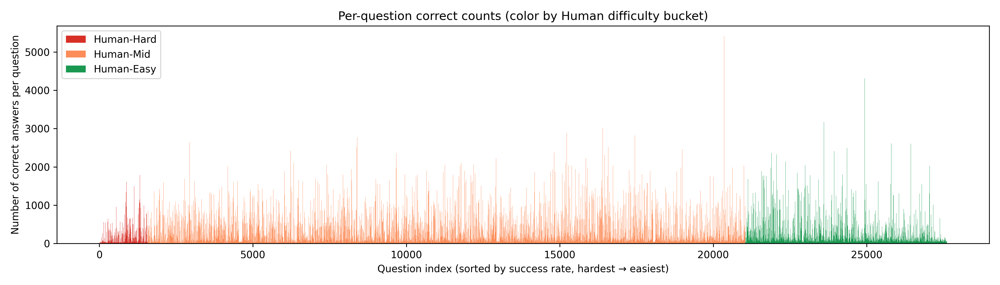
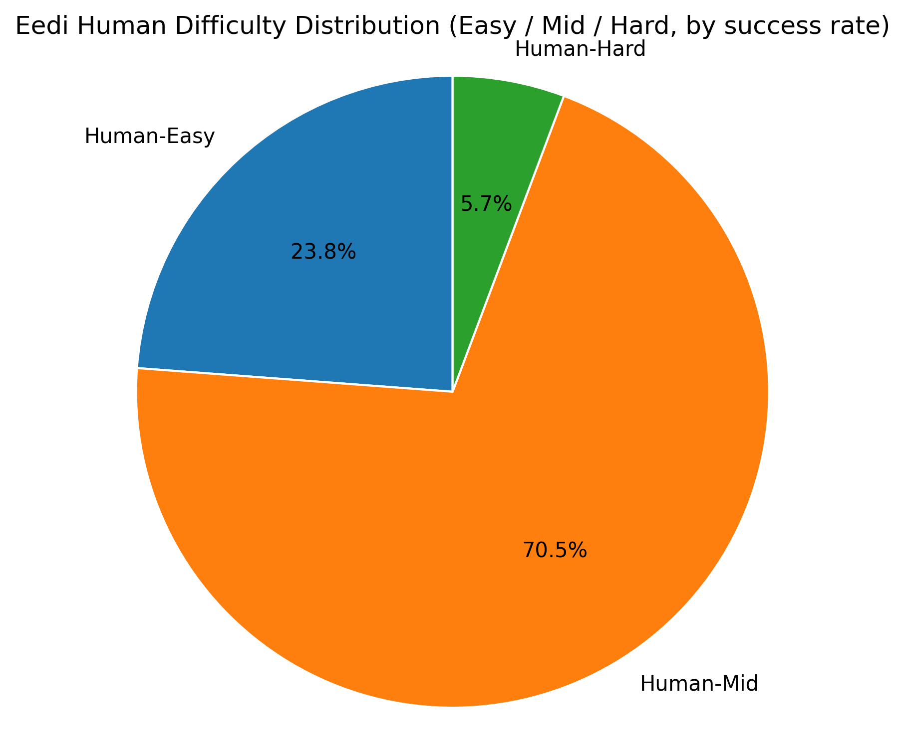
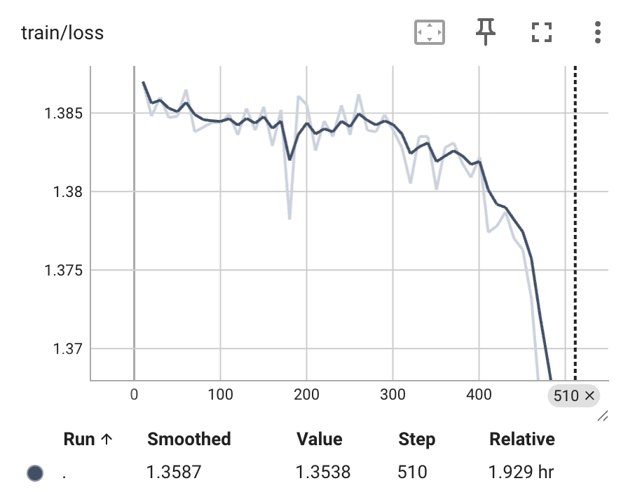
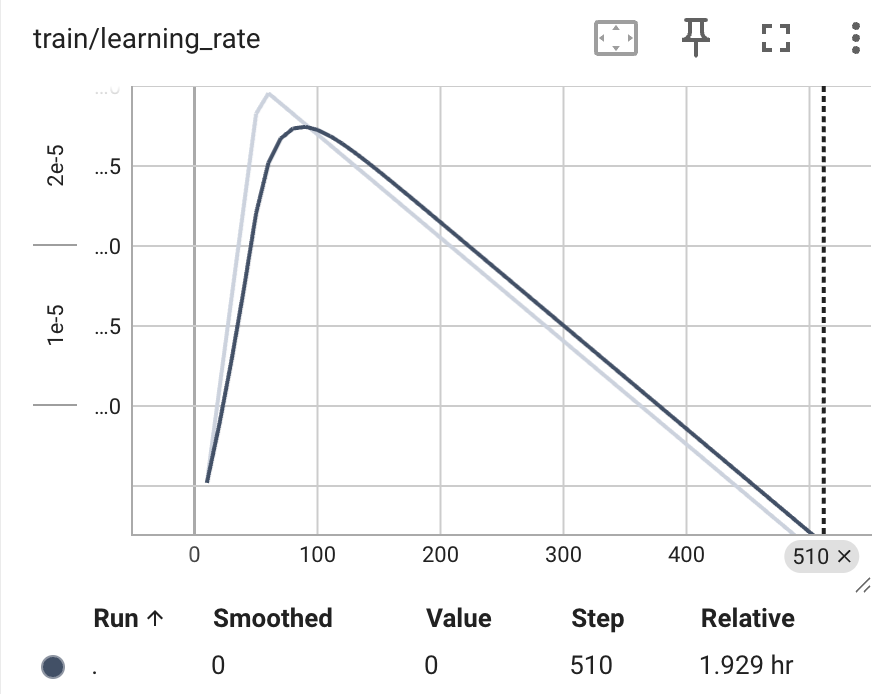
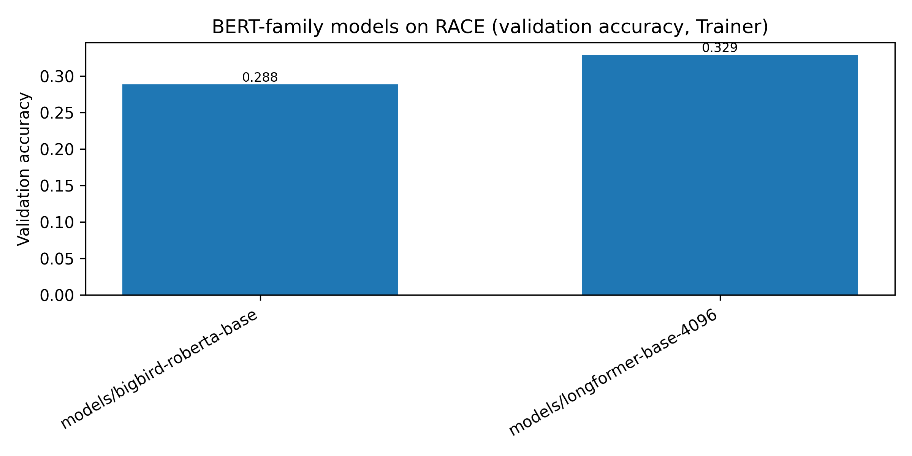
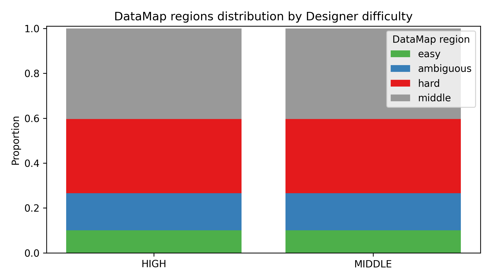
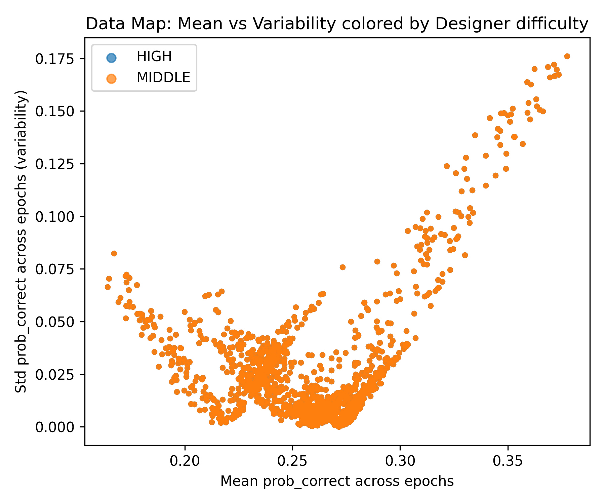
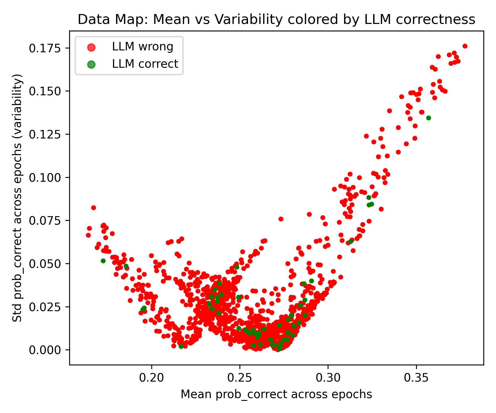
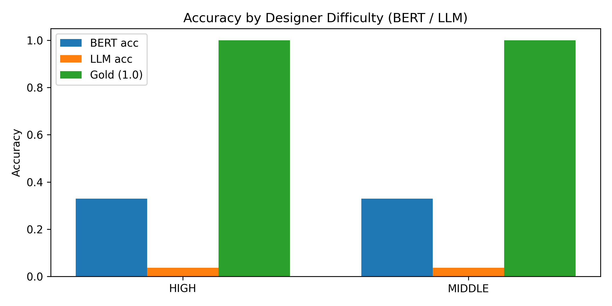

# 📉 Quantifying Question Difficulty: Alignment Analysis via Data Cartography

> **One-Liner:** Using a robust discriminator model + **Data Cartography** to characterize and verify the alignment of "Question Difficulty" across four perspectives: **Students**, **Instructional Designers**, **Text Encoders (BERT)**, and **LLMs**.

## 📖 Overview

### Core Logic
1.  **The Problem with Generative LMs:**
    * Pre-training objectives for LLMs (CausalLM) are not supervised difficulty grading.
    * Direct decoding confidence from LLMs is not a reliable proxy for "Question Difficulty."
2.  **The Value of Discriminative Models:**
    * BERT-series models (with classification heads) offer interpretable internal states via last-hidden-state analysis.
3.  **Alignment Goals:**
    * *Student vs. Model:* Do questions humans fail also trigger "Hard" labels in models?
    * *Designer vs. Dynamics:* Do questions marked "Hard" by designers appear as "Hard-to-learn" in Data Maps?
    * *LLM vs. Encoder:* Is there a discrepancy between LLM-generated difficulty tags and Text-Encoder learning dynamics?

### Methodology: Data Cartography
Following the [Data Cartography](https://arxiv.org/abs/2009.10795) approach, we record the training dynamics of each sample across epochs to calculate:
* **Confidence:** Mean probability of the gold label.
* **Variability:** Standard deviation of probabilities.
* **Correctness:** Proportion of epochs predicted correctly.

This categorizes questions into:
* 🟢 **Easy-to-learn**
* 🔴 **Hard-to-learn**
* 🟡 **Ambiguous**

---

## 🛠️ Datasets

### 1. Eedi (NeurIPS 2020)
* **Focus:** Student Behavior (RQ1 & RQ2A).
* **Fields:** `student_id`, `question_id`, `is_correct`, `confidence`, `timestamp`.
* **Purpose:** Deriving "Human Difficulty" (Error rates) and "Human Perception" (Student self-assessment).

### 2. RACE (Benchmark)
* **Focus:** Instructional Designer Difficulty (RQ2B).
* **Fields:** `article`, `question`, `options`, `answer`, `difficulty` (Middle/High).
* **Purpose:** Ground truth for "Designer" difficulty.

### 3. LLM Synthetic Data
* **Focus:** LLM Perception.
* **Method:** Generated via API (O1/GPT-4o) with prompts targeting `target_difficulty` (easy/mid/hard).

---

## 🚀 Usage & Pipeline

### Prerequisites
Setup the environment and download necessary models (Longformer/BigBird).

```bash
# Install dependencies
bash build_env.sh
# Download models (requires aria2, longformer&bigbird)
bash scripts/hfd.sh allenai/longformer-base-4096
mv longformer-base-4096 models/
bash scripts/hfd.sh google/bigbird-roberta-base
mv bigbird-roberta-base models/
```

# Phase 1: Eedi Dataset Analysis (Student Perspective)
Analyze the Eedi dataset to establish empirical difficulty thresholds based on real student performance.
- Heuristic Thresholds:
    - 🟢 Easy: Accuracy $\ge$ 0.8
    - 🔴 Hard: Accuracy $\le$ 0.4
    - 🟡 Medium: 0.4 < Accuracy < 0.8
Execution:
```
# Results will be saved to the 'Eedi_analysis' directory
python scripts/Eedi_human_difficulty_analysis.py \
  --inputs data/train_task_1_2.csv data/train_task_3_4.csv \
  --out_dir Eedi_analysis \
  --easy_thr 0.8 \
  --hard_thr 0.4
```

### 📜 Script Analysis: `Eedi_human_difficulty_analysis.py`

This script establishes the **"Ground Truth"** for question difficulty from the Student's perspective. It aggregates raw interaction logs to compute statistical difficulty metrics.

#### Core Logic
1.  **Data Aggregation (`load_and_check_multiple`)**:
    * Supports merging multiple partitioned CSV files (e.g., `task_1_2.csv`, `task_3_4.csv`).
    * Standardizes column names to `question_id`, `student_id`, and `is_correct`.
2.  **Metric Calculation (`compute_question_difficulty`)**:
    * Groups data by `question_id`.
    * Calculates **Accuracy** ($\text{Mean Correct}$) and **Total Attempts**.
    * *Filter:* Drops questions with fewer than `min_attempts` (default: 5) to ensure statistical significance.
3.  **Heuristic Bucketing (`bucket_by_rate`)**:
    * Classifies questions based on accuracy thresholds:
        * **Human-Hard**: $Acc \le 0.4$
        * **Human-Easy**: $Acc \ge 0.8$
        * **Human-Mid**: $0.4 < Acc < 0.8$
4.  **Visualization**:
    * **Pie Chart**: Shows the global distribution of difficulty classes.
    * **Bar Chart**: Visualizes the "long tail" of question difficulty, colored by category.


Outputs:
- eedi_question_correct_counts_bar.png: Absolute correct counts (Student Hard perspective).
    
- eedi_human_difficulty_pie.png: Distribution of difficulty categories.
    
- .csv files: Generated for subsequent alignment steps.
    Category (human_bucket) | Count (n_items) | Ratio |
    :--- | :---: | :---: |
    **Human-Easy** | 6,574 | 23.81% |
    **Human-Mid** | 19,460 | 70.47% |
    **Human-Hard** | 1,579 | 5.72% |


# Phase 2: RACE Processing & Text-Encoder Training

In this phase, we focus on fine-tuning long-context Transformer models (like Longformer and BigBird) on the RACE dataset. The primary objective here is not just to achieve high accuracy, but to meticulously record the **"Training Dynamics"** of every individual sample across training epochs.

This process generates the raw data necessary for **Data Cartography**, allowing us later to map samples into distinct categories (e.g., "easy-to-learn," "ambiguous," or "hard") based on how the model interacted with them during training.

---

### 1. Preprocessing & Length Verification

The raw RACE dataset structures multiple questions under a single passage. We must first decompose this into flattened, individual examples suitable for standard model input.

Furthermore, standard BERT-based models have a strict 512-token limit. RACE passages are often longer. We must verify token lengths to ensure our chosen long-context architectures (capable of 2048 or 4096 tokens) can handle the data without excessive truncation that might lose crucial context needed to answer the question.

```bash
# (Optional) Pre-process data: Flattens JSONL into CSVs with individual QA pairs
python scripts/RACE_process_data.py

# Verify input lengths: Checks if data fits within architectural limits (e.g., 2048 tokens)
# This ensures we don't silently truncate important parts of long passages.
python scripts/check_input_len.py --data_csv race_prepared/race_mcq_train.csv --model_name models/bigbird-roberta-base --max_len 2048
python scripts/check_input_len.py --data_csv race_prepared/race_mcq_train.csv --model_name models/longformer-large-4096 --max_len 2048
```
### 2. Training & Dynamics Recording
We train the selected text-encoder using the Hugging Face Trainer API. The crucial component here is a custom callback inserted into the training loop.

What the callback does: At the end of each epoch, before the data loader reshuffles for the next epoch, the callback performs a forward pass on the training set and records the raw logits (unnormalized prediction scores) for the ground-truth class of every specific sample ID.


These recorded epoch-wise logs are later aggregated to calculate the three key Data Cartography metrics for each sample:

- Confidence: The mean predicted probability of the correct answer across epochs.

- Variability: The standard deviation of the predicted probabilities across epochs (indicating model uncertainty/flipping).

- Correctness: The fraction of epochs where the model predicted the answer correctly.
 
```
# Example Training Command:
# Trains BigBird/Longformer for 5 epochs, recording dynamics at each step.
# Note: Batch size is optimized for 8x A100-80G GPUs. Adjust if necessary.
# Tuned models will be saved in directories like 'race_trainedmodels_5e-4_e5_256bs'

python scripts/RACE_train_bert_models_trainer.py \
    --data_dir race_prepared \
    --out_dir race_trainedmodels \
    --epochs 5 \
    --lr 3e-5  \
    --batch_size 16 \
    --eval_batch_size 32 \
    # --model_name models/bigbird-roberta-base (Specify model if needed, defaults in script)
```
- Details of training



### 3. Outputs
After training completes, the script generates several key files needed for analysis in Phase 3:
- training_dynamics_{split}.csv (e.g., for train/val):
    - This is the most critical output file. It is a large CSV log containing columns like [guid, index, epoch, logits, gold_label].
    - It serves as the raw fuel for calculating Data Maps. It represents the complete history of the model's perception of every data point throughout training.
- models_val_accuracy_bar.png:
    - A visual benchmark comparison showing the final validation accuracy achieved by different trained architectures (e.g., comparing BigBird vs. Longformer performance on RACE).
- Saved Model Checkpoints:
    - The fine-tuned model weights saved in the specified --out_dir.


# Phase 3: LLM Inference

### Logical Flow

1.  **Define Models and Parameters**:
    * Defines multiple GPT-4o model versions (`model_list`, `best_model`, `ci_best_model`, `back_model`).
    * Defines a global variable `last_sentence` (unused).

2.  **Define General API Request Functions**:
    * **`requestGPT4`**:
        * Accepts parameters like instruction, query, API key, temperature, model, etc.
        * Constructs request headers and payload matching the GPT-4 API format.
        * Sends the request using `requests.post` and retries on failure (with a very large max retry count).
        * Parses the response JSON, extracts, and returns the model's generated text content.
    * **`requestDoubao`**:
        * Uses the `openai` client library to connect to the Doubao API (requires replacing base_url and api_key).
        * Sends a chat completion request, specifying the Doubao model.
        * Parses the response and returns the generated content. Includes retry logic.
    * **`requestDeepseek`**:
        * Similar to `requestDoubao`, uses the `openai` client library to connect to the Deepseek API (requires replacing base_url and api_key).
        * Sends a request and parses both the content and reasoning content (thinking_res). Includes retry logic.

3.  **Define API Request Function with Dynamic Temperature Adjustment**:
    * **`requestGPT4_plus`**:
        * Similar to `requestGPT4`, but adds a check for specific labels (`label`).
        * In the retry loop, if the end of the result does not contain expected label characters, it dynamically adjusts the temperature parameter (`temperature`) to a random value between 0.1 and 1.5, prints a log, and retries.
        * Uses a specific API endpoint (`https://search.bytedance.net/gpt/openapi/online/v2/crawl`).

4.  **Define Single Data Processing Function**:
    * **`process_manyidu_v3`**:
        * Accepts a single line JSON string, instruction, API key, and model parameters.
        * Parses the JSON data, extracts the `prompt` field, and appends a request to only provide the final answer.
        * Calls the `requestDoubao` function (**Note: This hardcodes the call to Doubao, ignoring the passed `model` parameter**) to get the model output.
        * Returns the model's output result.

5.  **Define Parallel Data Processing Pipeline**:
    * **`manyidu_pipeline`**:
        * Accepts model name, instruction, and input file path.
        * Reads all lines from the input JSONL file.
        * Defines an API key (hardcoded).
        * Determines the output file path.
        * Uses `ThreadPoolExecutor` to create a thread pool with a maximum of 32 workers.
        * Iterates through all input lines, submits `process_manyidu_v3` tasks to the thread pool, and uses `tqdm` to show submission progress.
        * Iterates through completed tasks (`as_completed`), using `tqdm` to show processing progress.
        * Gets the result of each task, parses the original JSON line, adds an `llm_label` field to store the model result.
        * Writes the updated JSON object to the output file.
        * Captures and prints exceptions during processing.

6.  **Define Data Splitting and Cleaning Function**:
    * **`split_geci`**:
        * Accepts an input directory path.
        * Iterates through all `.jsonl` files in the directory that do not contain 'eng'.
        * Reads files, parses JSON, and extracts the `gpt_result` field.
        * Filters out results containing '抱歉' (sorry).
        * Deduplicates the extracted data.
        * Splits each data entry by `|` into multiple parts.
        * Writes all split parts to a new text file `kuochong_data.txt`.

7.  **Main Function Execution**:
    * In the `if __name__=="__main__":` block, calls the `manyidu_pipeline` function twice.
    * The first call processes the `race_prepared/race_llm_prompts_test.jsonl` file using `best_model` and a specified reading comprehension instruction.
    * The second call processes the `race_prepared/race_llm_prompts_val.jsonl` file using the same model and instruction.
    * **Note: Although `best_model` (gpt-4o-2024-11-20) is passed, `process_manyidu_v3` called internally by `manyidu_pipeline` actually uses `requestDoubao`, so the Doubao model is used in the end.**

Gather difficulty labels from SOTA LLMs (GPT-4o, Doubao, DeepSeek-R1) using a majority vote mechanism (2/3 consensus) on validation and test sets.
```
# Note: Replace API keys in the script before running
python scripts/LLM_request.py

# Post-process and aggregate results
python scripts/proecess_test.py
```
- Output Storage: LLM_out/gpt4o_1124

# Phase 3 (Extended): Multi-View Alignment Analysis (Designer, BERT, LLM, & Data Cartography)

## 1. Overview

This phase performs a comprehensive, multi-perspective analysis of the RACE validation set. It moves beyond simple accuracy metrics to understand *how* different systems (human designers, a discriminative BERT model, and a generative LLM) perceive the difficulty of questions.

The core innovation is the integration of **Data Cartography** (based on the BERT model's training dynamics from Phase 2) as a fourth, empirically-derived "view" of difficulty. The script merges data from four different sources to create a unified dataset for deep analysis.

## 2. Input Data Files

The script takes four distinct input files, each representing a different "view" or piece of information about the validation questions:

1.  `--race_val_csv`: The ground truth data from Phase 1 (e.g., `race_prepared/race_mcq_val.csv`).
    * **Provides:** `question_id`, `label` (numeric gold answer 0-3), `answer_letter` (gold A-D), and `designer_difficulty_str` ("MIDDLE" or "HIGH").
2.  `--bert_pred_csv`: The BERT model's final, trained predictions on the validation set (e.g., `val_predictions.csv`).
    * **Provides:** `question_id`, `bert_pred_label` (0-3), and `bert_prob_correct` (the model's confidence in the gold answer).
3.  `--llm_res_jsonl`: The LLM's evaluation results on the validation set (e.g., from an evaluation pipeline).
    * **Provides:** `question_id`, `llm_pred_label` (A-D or 0-3, will be normalized), and optionally `llm_correct` (boolean or 0/1).
4.  `--bert_td_csv`: The raw training dynamics logs from Phase 2 (e.g., `training_dynamics_val.csv`).
    * **Provides:** A row for every epoch and every question, containing `question_id`, `epoch`, `prob_correct` (model confidence in gold answer at that epoch), and `is_correct` (did the model get it right at that epoch).

## 3. Processing Logic & Metrics Computation

### 3.1. Data Loading and Cleaning

1.  **Load Ground Truth (`df_val`):** Reads the basic validation set metadata.
2.  **Load BERT Predictions (`df_bert`):** Reads the model's final answers and confidence scores.
3.  **Load & Normalize LLM Results (`df_llm`):**
    * Reads the JSONL file.
    * **Normalization:** The `safe_parse_llm_label` function robustly handles LLM outputs. It converts letter answers ("A", "B", "C", "D") or stringified numbers ("0", "1", "2", "3") into a standardized numeric label (0-3). Invalid or missing answers are set to `None`.
    * Duplicates are removed to ensure one prediction per `question_id`.
4.  **Load Training Dynamics (`df_td`):** Reads the raw, multi-epoch logs.

### 3.2. Data Merging

The script performs a series of `left` merges onto the base validation set (`df_val`) using `question_id` as the key. This ensures we keep all validation questions, even if some are missing from other files (though they shouldn't be).

* Merge BERT predictions to get `bert_pred_label` and `bert_prob_correct`.
* Merge LLM predictions to get `llm_pred_label` and `llm_correct`.
* **Correctness Calculation:**
    * `bert_correct`: Calculated by comparing `bert_pred_label` with the gold `label`.
    * `llm_correct`: If not explicitly provided in the input, it's calculated by comparing the normalized `llm_pred_label` with the gold `label`. Missing values are filled with 0 (incorrect).

### 3.3. Data Map Metrics Computation

This is the core analytical step, performed in `compute_datamap_metrics(df_td)`. For each `question_id`, it aggregates the multi-epoch data from `df_td` to calculate three key metrics:

1.  **`mean_prob` (Confidence):** The average probability assigned to the correct answer across all training epochs. High confidence means the model consistently thought the correct answer was likely.
2.  **`std_prob` (Variability):** The standard deviation of the probability assigned to the correct answer. High variability means the model was uncertain and its confidence fluctuated wildly during training.
3.  **`frac_correct` (Correctness):** The proportion of epochs where the model's top prediction was actually correct.

### 3.4. Data Map Region Assignment

Based on these metrics, each question is categorized into one of four "Data Map Regions" using thresholds (often terciles of the data distribution):

* **Easy:** High confidence (`mean_prob` in top third), low variability (`std_prob` in bottom third). The model learns these quickly and consistently.
* **Hard:** Low confidence (`mean_prob` in bottom third), low correctness (`frac_correct` < 0.5). The model rarely gets these right and has low confidence in the gold answer.
* **Ambiguous:** High variability (`std_prob` in top third). The model is "confused," flip-flopping between being confident and unconfident in the correct answer.
* **Middle:** Everything else that doesn't fit the extreme criteria above.

# Phase 4  Observing the Alignment of "Difficult" Labels Across Four Collected Perspectives

* **Objective:** To obtain and compare the domains of "difficult" labels from four distinct perspectives:
    * **Designer Perspective:** The difficulty level assigned by the human creators of the dataset (Middle vs. High school).
    * **Text-Encoder (BERT-series) Perspective:** Difficulty as empirically determined by the training dynamics of a fine-tuned BERT-based model (Data Cartography regions like "Hard" and "Ambiguous").
    * **Student Perspective (Human):** (Implied, not explicitly modeled with data here, but conceptually linked to the designer's intent).
    * **LLM Perspective:** Difficulty implied by the performance (correctness) of a Large Language Model on the tasks.

* **Code Execution:**
    Run the analysis script, pointing to the four prepared data sources (Ground Truth, BERT Predictions, BERT Training Dynamics, and LLM Results).

    ```bash
    # Note: Update the paths if you tuned your own models or have different file locations.
    python scripts/RACE_analyze_views_with_datamap.py \
        --race_val_csv race_prepared/race_mcq_val.csv \
        --bert_pred_csv race_trainedmodels_5e-4_e5_256bs/models_longformer-base-4096/val_predictions.csv \
        --bert_td_csv race_trainedmodels_5e-4_e5_256bs/models_longformer-base-4096/training_dynamics_val.csv \
        --llm_res_jsonl LLM_out/gpt4o_1124/race_llm_prompts_val_gpt.jsonl \
        --out_dir race_analysis_with_datamap
    ```

* **Key Findings on Alignment:**
    * The alignment of the three computational views (BERT, LLM) with the Designer's view in the empirically "hard/ambiguous" regions is not perfect.
    * **LLM vs. Designer Alignment:** Relatively speaking, the LLM's performance aligns better with the Designer's intended difficulty than the Text-Encoder's does. This indirectly supports the hypothesis that the LLM's pre-training phase effectively models the kind of logical reasoning required by these questions.
    * **Text-Encoder Inaccuracy:** The BERT-based model's predictions are less accurate and its view of difficulty is less aligned. Possible reasons include:
        * **Pre-training Task Mismatch:** BERT-like models are pre-trained on "masked language modeling" (cloze tests), not multiple-choice classification tasks.
        * **Complex Logic:** The reasoning required for RACE questions involves complex logic that may not have been well-modeled during BERT's pre-training, making this specific task too difficult for it to grasp fully.

* **Visualizations & Analysis:**

    * **Designer Perspective - Data Map Regions:**
        This stacked bar chart shows how questions from different designer difficulty levels ("MIDDLE", "HIGH") are distributed across the empirically derived Data Map regions ("easy", "ambiguous", "hard").
        

    * **Designer Perspective - Data Map Scatter Plot:**
        This scatter plot visualizes individual questions on the Data Map (Confidence vs. Variability), colored by their designer-assigned difficulty. It helps see where "HIGH" difficulty questions tend to cluster.
        

    * **LLM Perspective - Data Map Scatter Plot:**
        This plot is identical to the one above but colored by LLM correctness (Green = Correct, Red = Incorrect). A high degree of overlap with the designer plot suggests that questions the LLM gets wrong often correspond to those designers labeled as "HIGH" difficulty.
        

    * **Model Accuracy vs. Designer Difficulty:**
        This grouped bar chart compares the raw accuracy of the Text-Encoder (BERT) and the LLM across the two designer difficulty levels. It clearly shows the LLM's superior performance and better alignment with the designer's intended difficulty gradient compared to the Text-Encoder.

* **Images**
    - Designer perspective  
    

    - Designer-perspective distribution  
    

    - LLM perspective (highly overlapping with designer)  
    

    - LLM matches Text-Encoder better  
    