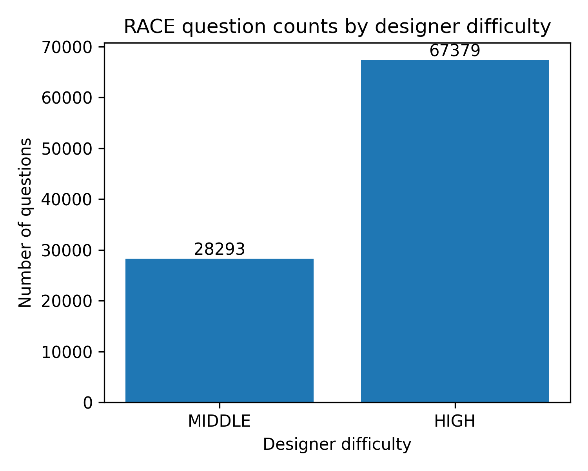

# 📉 Quantifying Question Difficulty: Alignment Analysis via Data Cartography

> **One-Liner:** Using a robust discriminator model + **Data Cartography** to characterize and verify the alignment of "Question Difficulty" across four perspectives: **Students**, **Instructional Designers**, **Text Encoders (BERT)**, and **LLMs**.

## 📖 Overview

### Core Logic
1.  **The Problem with Generative LMs:**
    * Pre-training objectives for LLMs (CausalLM) are not supervised difficulty grading.
    * Direct decoding confidence from LLMs is not a reliable proxy for "Question Difficulty."
2.  **The Value of Discriminative Models:**
    * BERT-series models (with classification heads) offer interpretable internal states via last-hidden-state analysis.
3.  **Alignment Goals:**
    * *Student vs. Model:* Do questions humans fail also trigger "Hard" labels in models?
    * *Designer vs. Dynamics:* Do questions marked "Hard" by designers appear as "Hard-to-learn" in Data Maps?
    * *LLM vs. Encoder:* Is there a discrepancy between LLM-generated difficulty tags and Text-Encoder learning dynamics?

### Methodology: Data Cartography
Following the [Data Cartography](https://arxiv.org/abs/2009.10795) approach, we record the training dynamics of each sample across epochs to calculate:
* **Confidence:** Mean probability of the gold label.
* **Variability:** Standard deviation of probabilities.
* **Correctness:** Proportion of epochs predicted correctly.

This categorizes questions into:
* 🟢 **Easy-to-learn**
* 🔴 **Hard-to-learn**
* 🟡 **Ambiguous**

---

## 🛠️ Datasets

### 1. Eedi (NeurIPS 2020)
* **Focus:** Student Behavior (RQ1 & RQ2A).
* **Fields:** `student_id`, `question_id`, `is_correct`, `confidence`, `timestamp`.
* **Purpose:** Deriving "Human Difficulty" (Error rates) and "Human Perception" (Student self-assessment).

### 2. RACE (Benchmark)
* **Focus:** Instructional Designer Difficulty (RQ2B).
* **Fields:** `article`, `question`, `options`, `answer`, `difficulty` (Middle/High).
* **Purpose:** Ground truth for "Designer" difficulty.

### 3. LLM Synthetic Data
* **Focus:** LLM Perception.
* **Method:** Generated via API (O1/GPT-4o) with prompts targeting `target_difficulty` (easy/mid/hard).

---

## 🚀 Usage & Pipeline

### Prerequisites
Setup the environment and download necessary models (Longformer/BigBird).

```bash
# Install dependencies
bash build_env.sh
# Download models (requires aria2)
bash scripts/hfd.sh allenai/longformer-base-4096
mv longformer-base-4096 models/
bash scripts/hfd.sh google/bigbird-roberta-base
mv bigbird-roberta-base models/
```


# 总体目标
- 一句话总结
    - 用一个“靠谱的判题模型 + Data Map”来刻画和验证「题目难度」在：学生、命题人、文本判别器（BERT）、LLM之间的对齐关系。只需要在“难度”这一维度上研究
- 逻辑线条
    1. 核心观点
        - 生成式LM本身的置信度不高
            - LLM的pre-train阶段是CasualLM的训练目标，而非有监督的训练
            - 不能直接用LLM解码后的结果当「题目难度」的置信标签
        - BERT系列这类有监督的判别器更具「说服性」
            - 带分类头的Text-Encoder能通过last-hiddenstate进行解释
        - 仅对「难度」这一问题进行alignment
            - 总结起来即为
                1. 人觉得「难」的题，模型也会打出hard标签么？
                2. “命题人”认为「难」 的命题，DataMap也能呈现“hard-to-learn”么？
                3. LLM标注的 easy/mid/hard放到 Text-Encoder + Data Map 中会存在区别么？
        - DataMap（Data Cartography）作为衡量标准
            - 用论文中提到的方法
                - 记录每个样本在每个epoch上对gold label的概率
                - 的到每题的：
                    1. confidence（不同epoch的平均gold prob）
                    2. variability
                    3. correctness（预测正确epoch的比例）
                - 因此可以把题目分成三类
                    - easy-to-learn
                    - hard-to-learn
                    - ambiguous
- 总结：本工作构建了一个以Text-Encoder为基础的DataMap，用于刻画题目在训练过程中的「难度」等级，并与学生的真实行为（Eedi Dataset）、命题人难度标注（RACE Dataset）以及LLM生成的难度标签分析


## 完整技术路线
### 数据集
- Eedi（NeurlPS2020 OR Data）
    - 字段：student_id, question_id, is_correct, confidence, timestamp
    - 用途：
        - RQ1: Human difficulty（答错率+自评）
        - RQ2（A）：Human Perception（学生自评）
- Race（SuperGLEU数据集中的一个benchmark）
    - 字段：article, question, options, answer, difficulty(middle/high)
    - 用途：
        - RQ2（B）：Instructional-designer difficulty（命题者难度）
- LLM生成题目数据
    通过prompt调api（多线程异步）
    - o1/4o 生成带targe_difficulty（easy/mid/hard）字段的题目

### 步骤
#### S1. 分析Eedi数据集
- 分析Eedi
    - 代码执行
    ```
    # 结果存储在 Eedi_analysis
    python scripts/Eedi_human_difficulty_analysis.py
    ```
    - 统计每道题学生答错的情况，按照“教育学经验值”拍出三档阈值
        - 简单：Acc >= 0.8
        - 困难：Acc <= 0.4
        - 中等: 0.4 < Acc < 0.8
    - 得到分析结果
        - 存放在Eedi_analysis中
            - 包含真实情况下标签（统计每道题目做对人数绝对数量，提供hard的学生视角）、真实情况下count图 eedi_question_correct_counts_bar.png以及统计饼图 eedi_human_difficulty_pie.png
            
            
            - 同样提供统计值，存放在.csv中 方便后续Alignment对齐使用
#### S2. 处理RACE数据集+训练Text-Encoder系列model+映射DataMap
- 拆解RACE数据集为单问答样本形式
    - 代码执行
    ```
    # 已经处理好 故无需再执行
    python scripts/RACE_process_data.py
    ```
    - 方便Text-Encoder系列模型训练
    - 方便生成LLM的prompt
    - 统计ground-true label作为命题人视角下题目难度分布
    
- 确认RACE数据集拆解后的max_token长度（scripts/check_input_len.py），因为bert系列（RoBERTa、DeBERTa的max_token均为512，超过会截断，从而导致训练loss不降）确认模型应使用longformer以及bigbert（主要是长度的考虑）
    - 下载这两个模型（方便做模型见的消融，8卡80g-A100的极限只能跑base，如果有多node情况可以尝试large，此处不赘述）
    ```
    # 有一些环境需要装
    bash build_env.sh
    bash scripts/hfd.sh allenai/longformer-base-4096
    mv longformer-base-4096 models/
    bash scripts/hfd.sh google/bigbird-roberta-base
    mv bigbird-roberta-base models/
    ```
    - 训练&预测&打分&绘图
    ```
    # 首先需要判断设置的maxtoken长度是否合适 
    python scripts/check_input_len.py --data_csv race_prepared/race_mcq_train.csv --model_name models/bigbird-roberta-base --max_len 2048
    python scripts/check_input_len.py --data_csv race_prepared/race_mcq_train.csv --model_name models/longformer-large-4096 --max_len 2048
    # 8卡80g-A100 4h 5个epoch
    # 我这边tune好的存在了 race_trainedmodels_5e-4_e5_256bs
    python scripts/RACE_train_bert_models_trainer.py --data_dir race_prepared --out_dir race_trainedmodels --epochs 5 --lr 3e-5  --batch_size 16 --eval_batch_size 32
    ```
        - 训练代码中加入回调函数用于计算「平均置信度」、「置信度波动」以及「正确率」用于做DataMap分类。信息存储于race_trianedmodels/training_dynamics_val.csv
        - 不同模型性能差距
        
#### S3. 请求 「豆包」「GPT4o」「DeepSeek-R1」
- 用多轮投票的方式刷RACE的val和test，分别请求三个模型，然后通过多轮投票（2/3取真）得到当前样本的预测标签
    - 代码执行
    ```
    # 请求LLM 需要在代码里替换掉你自己的api&key
    python scripts/LLM_request.py
    # 数据后处理
    python scripts/proecess_test.py
    ```
    - 存储于LLM_out/gpt4o_1124中
#### S4. 通过收集到的四种视角，观察「困难」label的对齐程度
- 分别得到命题人视角（Designer）、Text-Encoder（BERT系列）视角（Text）、学生视角（Human）、LLM视角（LLM）下的「困难」label的域 
    - 代码执行
    ```
    # 如果你自己tune的话 改一下路径就好了
    python scripts/RACE_analyze_views_with_datamap.py --race_val_csv race_prepared/race_mcq_val.csv --bert_pred_csv race_trainedmodels_5e-4_e5_256bs/models_longformer-base-4096/val_predictions.csv --bert_td_csv race_trainedmodels_5e-4_e5_256bs/models_longformer-base-4096/training_dynamics_val.csv --llm_res_jsonl LLM_out/gpt4o_1124/race_llm_prompts_val_gpt.jsonl --out_dir race_analysis_with_datamap
    ```
    - 三折在“hard/ambiguous”区域上的对齐程度并不好
        - 相对而言 LLM与Designer的对齐程度更好，也侧面应证了LLM Pre-Train 阶段建模的是逻辑能力
        - Text-Encoder预测的Acc不准确，可能原因如下
            - BERT这类模型在Pretrain阶段是完成“完形填空”类任务，而不是「分类」任务；且输入过程且存在逻辑，在Pre-train阶段没有被很好的建模，因此本任务对BERT系模型来说过难了
                - 命题人视角
                
                - 命题人视角分布
                
                - LLM视角（与命题人高度重合）
                
                - 与Text-Encoder，LLM更match
                
